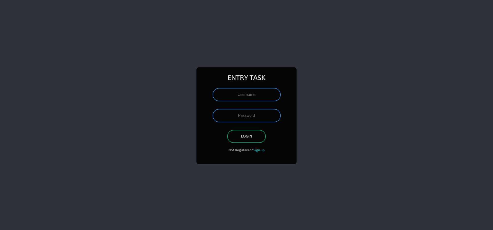
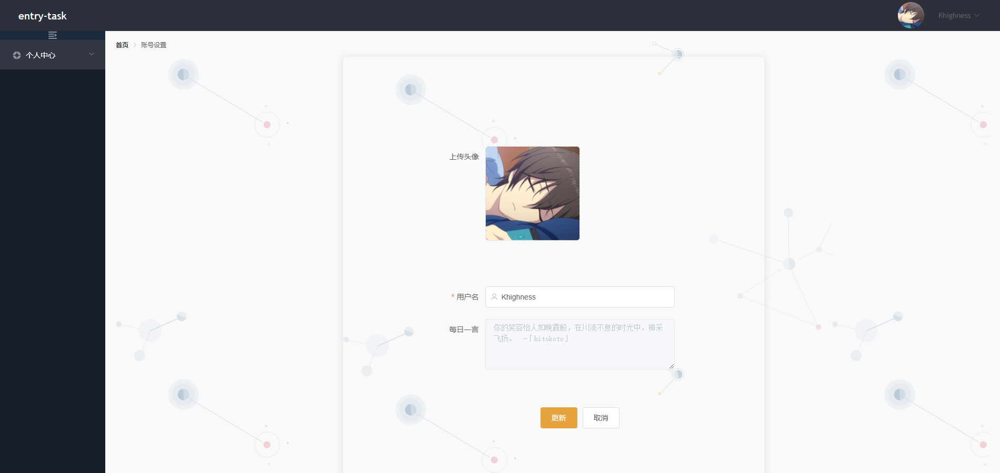

## entry-task

<p align="center">
  
</p>
<p align="center">
  <a href="doc/entry/webapi.md">📑 WEBAPI</a> | <a href="doc/entry/deploy.md">🚀 DEPLOY</a> | <a href="doc/entry/bench.md">🛳 BENCH</a> 
</p>


### Feature

- Native http API based on Go lib
- Prefect connection pool for GRPC
- Beautiful front page built from VUE
- Elegant code style and exhaustive comments


### Structure

```
entry-task
    ├─bin              build script          
    ├─doc              mysql & docs
    ├─front            vue frontend
    ├─pb               grpc proto
    ├─rpc              rpc implement
    ├─tcp              tcp server
    └─web              web server
```


### Architecture

<p align="center">

</p>


### Preview

<table>
  <tr>
    <td>login</td>
    <td>profile</td>
  </tr>
  <tr>
     <td width="50%" align="top"></td>
     <td width="50%" align="top"></td>
  </tr>
</table>
